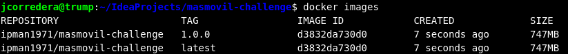
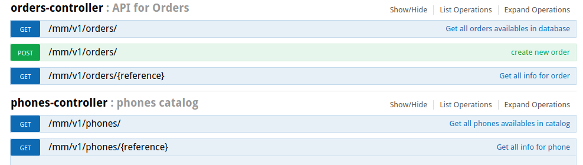
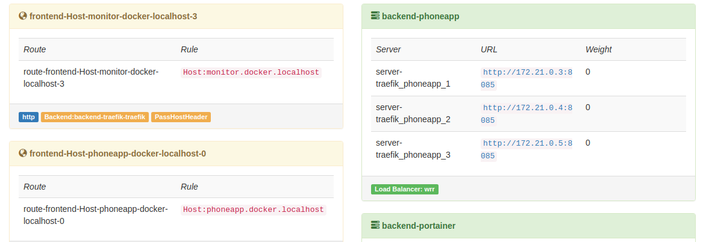

# MASMOVIL challenge solution

## Software requeriments for this project

+ Maven 3.3.9
+ JDK 8
+ Docker 1.17

# Howto build this project

```
mvn clean package
```

## Run this project

```
mvn springboot:run
```

or

```
cd target
java -jar masmovil-challenge-1.0.0.jar
```

## Run this project as docker container

1. Build docker image with Maven profile
```
mvn clean package -P BUILD_DOCKER
```
2. Verify docker image creation with
```
docker images
```


3. Run docker container with project

```
docker run -d --rm -p 8085:8085 ipman1971/masmovil-challenge
```
# Check challenge

## Endpoints availables



### GET /mm/v1/phones

Response:
```
[
    {
        "reference": 1,
        "model": "OnePlus5",
        "description": "description for OnePlus5",
        "image": "./oneplus5.png",
        "price": 450.78,
        "links": [
            {
                "rel": "self",
                "href": "http://localhost:8085/mm/v1/phones/1"
            }
        ]
    },
    {
        "reference": 2,
        "model": "Xiaomi MA1",
        "description": "description for Xiaomi MA1",
        "image": "./xiaomima1.png",
        "price": 179.5,
        "links": [
            {
                "rel": "self",
                "href": "http://localhost:8085/mm/v1/phones/2"
            }
        ]
    },
    {
        "reference": 3,
        "model": "iphone-7",
        "description": "description for Iphone 7",
        "image": "./iphone7.png",
        "price": 790.3,
        "links": [
            {
                "rel": "self",
                "href": "http://localhost:8085/mm/v1/phones/3"
            }
        ]
    },
    {
        "reference": 4,
        "model": "Xiaomi MI5",
        "description": "description for Xiaomi MI5",
        "image": "./xiaomi-mi5.png",
        "price": 290.35,
        "links": [
            {
                "rel": "self",
                "href": "http://localhost:8085/mm/v1/phones/4"
            }
        ]
    },
    {
        "reference": 5,
        "model": "Leeco S3",
        "description": "description for Leeco S3",
        "image": "./leeco-s3.png",
        "price": 120.7,
        "links": [
            {
                "rel": "self",
                "href": "http://localhost:8085/mm/v1/phones/5"
            }
        ]
    }
]
```

### GET mm/v1/phones/1

Response:
```
{
    "reference": 1,
    "model": "OnePlus5",
    "description": "description for OnePlus5",
    "image": "./oneplus5.png",
    "price": 450.78,
    "_links": {
        "self": {
            "href": "http://localhost:8085/mm/v1/phones/1"
        }
    }
}
```

### POST /mm/v1/orders

Request:

```
{
  "reference":2000,
  "name":"Pepe",
  "surname":"Corredera",
  "email":"pca@gmail.com",
  "productList":[2,3],
  "amount":0.0
}
```
Response:
```
{
    "reference": 2000,
    "name": "Pepe",
    "surname": "Corredera",
    "email": "pca@gmail.com",
    "productList": [
        2,
        3
    ],
    "amount": 969.8,
    "_links": {
        "self": {
            "href": "http://localhost:8085/mm/v1/orders/2000"
        }
    }
}
```
### GET /mm/v1/orders

Response:
```
[
    {
        "reference": 2000,
        "name": "Pepe",
        "surname": "Corredera",
        "email": "pca@gmail.com",
        "productList": [
            2,
            3
        ],
        "amount": 969.8,
        "links": [
            {
                "rel": "self",
                "href": "http://localhost:8085/mm/v1/orders/2000"
            }
        ]
    }
]
```

### GET /mm/v1/orders/2000

Response:

```
{
    "reference": 2000,
    "name": "Pepe",
    "surname": "Corredera",
    "email": "pca@gmail.com",
    "productList": [
        2,
        3
    ],
    "amount": 969.8,
    "_links": {
        "self": {
            "href": "http://localhost:8085/mm/v1/orders/2000"
        }
    }
}
```

## All info for endpoints with [Swagger](https://swagger.io/)

```
http://localhost:8085/swagger-ui.html#/phones-controller
http://localhost:8085/swagger-ui.html#/orders-controller
```

## Log trace develop by aspect

```
2018-02-17 18:27:56.077  INFO 3979 --- [           main] c.m.c.aspect.RepositoryLoggerAspect      : [REPOSITORY]: executed method: create() => Phone{reference=1, model=OnePlus5, description=description for OnePlus5, image=./oneplus5.png, price=450.78}
2018-02-17 18:27:56.078  INFO 3979 --- [           main] c.m.c.aspect.RepositoryLoggerAspect      : [REPOSITORY]: executed method: create() => Phone{reference=2, model=Xiaomi MA1, description=description for Xiaomi MA1, image=./xiaomima1.png, price=179.5}
2018-02-17 18:27:56.078  INFO 3979 --- [           main] c.m.c.aspect.RepositoryLoggerAspect      : [REPOSITORY]: executed method: create() => Phone{reference=3, model=iphone-7, description=description Iphone 7, image=./iphone7.png, price=790.3}
[REST-API]: List com.masmovil.challenge.controllers.PhonesController.findAll()
```

## REST API with HATEOAS

```
[
    {
        "reference": 1,
        "model": "OnePlus5",
        "description": "description for OnePlus5",
        "image": "./oneplus5.png",
        "price": 450.78,
        "links": [
            {
                "rel": "self",
                "href": "http://localhost:8085/mm/v1/phones/1"
            }
        ]
    },
    {
        "reference": 2,
        "model": "Xiaomi MA1",
        "description": "description for Xiaomi MA1",
        "image": "./xiaomima1.png",
        "price": 179.5,
        "links": [
            {
                "rel": "self",
                "href": "http://localhost:8085/mm/v1/phones/2"
            }
        ]
    },
    {
        "reference": 3,
        "model": "iphone-7",
        "description": "description Iphone 7",
        "image": "./iphone7.png",
        "price": 790.3,
        "links": [
            {
                "rel": "self",
                "href": "http://localhost:8085/mm/v1/phones/3"
            }
        ]
    }
]
```

# Response this questions:
## How would you improve the system?

1. Creation of diferent microservice for API module: Phones, Orders
2. Add BDD tests with any framework as Cucumber or similar.
3. Deploy of docker containers with Ansible.
4. Deploy of docker containers about any docker orchestrator system as Kubernetes or similar
5. Add monitor system as Prometheus o similar.

## How would you avoid your order api to be overflow?

1. In the folder traefik is available a custom solution for system scale based in start multiples microservice containers. The request to API will be balanced between all containers. Follow the instructions:

```
docker network create proxy
cd traefik
docker compose -d --scale phoneapp=3
```

### Verify multiples instances for this containers

1. Open browser and go to [Traefik monitor](http://monitor.docker.localhost/)



2. In this moment the system scale to 3 containers, the access to any endpoint has changed using new domain **http://phoneapp.docker.localhost**. For example for access to Phone API:

+ http://phoneapp.docker.localhost/mm/v1/phones/

For more info visit [Traefik home page](https://traefik.io/)
